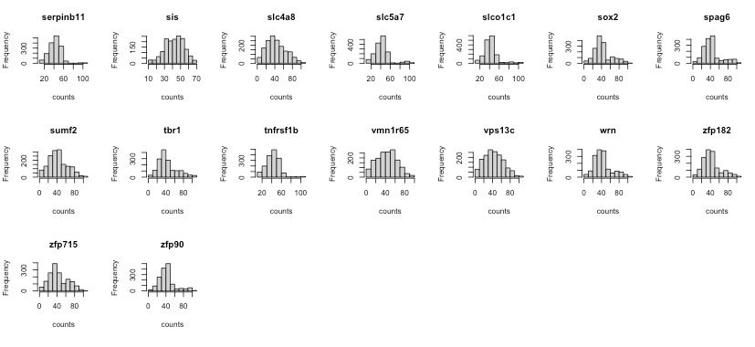
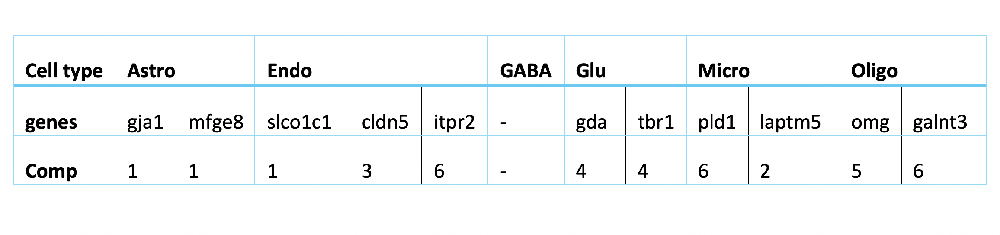

```{r setup, include=FALSE}
knitr::opts_chunk$set(echo = TRUE,warning=FALSE, message=FALSE, eval = TRUE)
```

```{r,echo=FALSE}
library(matrixStats)
library(mixOmics)
library(preprocessCore)
library(dplyr)
```

\bigskip

# Introduction

## Background 

Tasic et al. (2016) used scRNA sequencing to explore the extent of cell types of mouse primal visual cortex. In the study, 1723 high-quality cells with thousands of genes in primal visual cortex in male adult mice were sequenced on a single cell resolution for cell classification. This study identified 49 cell types, including 23 GABAergic, 19 glutamatergic and 7 non-neural types in the 1723 cells.

The cell classification result from Tasic et al. (2016) was used by Zhu et al. (2018) to design a study to distinguish the difference between intrinsic and extrinsic effect on gene expression. Intrinsic effect means the regulatory gene network, while extrinsic means the cellular microenvironment. The study was conducted by combining scRNA sequencing data and smFISH data (single-molecule fluorescence in situ hybridization). The former one has high molecular resolution of transcriptomics (thousands of genes) without spatial information, while the latter keeps the spatial information but loses the high resolution (only a few hundred genes). 

Zhu et al. (2018) mapped the sRNA sequencing data to the seqFISH data to enhance the molecular resolution of the cells using SVM (support vector machine). The model was trained to identify the major cell type difference by training on scRNA data of 8 groups, GABAergic and Glutamatergic are the major neuron types, and other non-neuronal types, including Astrocytes, Mndothelial cells, microcytes, and three types of Oligocytes. The selected features (genes) were the top 43 differentially expressed (DE) genes in the identified 113 genes. The classification result was FURTHER validated by different evidence like cell type specific staining and previously reported marker genes.

Now, given a dataset of gene expression levels of 1723 cells and 113 genes and the cell types (from Tasic et al. 2016), our task is to predict the cells provided by Zhu et al. (2018), 1597 cells with 113 genes.

**Outline of analysis:**

We will adopt a semi-supervised approach to classify the cells of seqFISH data.

1. Train an sPLS-DA model on scRNA dataset. 
2. Select genes by limiting the number of genes of "keepX" argument of each component during hyperparameter tuning.
3. Predict seqFISH data using the trained sPLS-DA model. 
4. The predictions with high probabilities by the sPLS-DA model will be combined to the original training data for further training. 
5. Train a MINT model on the combined training dataset and predict the rest cells of seqFISH data.
6. Identify the marker genes by examining the loading factors.

This semi-supervised method can borrow the information from the seqFISH data and make the model customised. The combination of the data will be used to train a MINT.sPLS-DA model. MINT (Multivariate INTegrative method) (Rohart et al. 2017) is robust for integrating data from different sources regardless of the batch effect. The top discriminative genes identified from the model will be validated using previous literature as evidence. The determination of the minimal number of genes will be done by restricting the values of keepX and the performance will be monitored by balanced error rate (BER). BER is the average of the proportion of wrong classifications in each class. The lower the BER, the more accurate the model is.

## Data

First import the data, including the training data (`scRNA`), the training labels (`scRNA_label`), the test data (`seqFISH`) and the predicted test labels by Zhu's paper (`seqFISH_label`).

```{r}
##### import the data #####
scRNA1 = read.delim("data/tasic_training_b2.txt",header = FALSE, sep ='\t') 
scRNA <- scRNA1[,-1]
rownames(scRNA) <- scRNA1[,1]
scRNA = data.frame(t(scRNA))
rownames(scRNA) <- paste(rep("scRNA",dim(scRNA)[1]),1:dim(scRNA)[1],sep = "_")
  
seqFISH1 = read.delim("data/seqfish_cortex_b2_testing.txt",header = FALSE, sep ='\t') 
seqFISH <- seqFISH1[,-1]
rownames(seqFISH) <- seqFISH1[,1]
seqFISH = data.frame(t(seqFISH))
rownames(seqFISH) <- paste(rep("seqFISH",dim(seqFISH)[1]),1:dim(seqFISH)[1],sep = "_")

scRNA_label = read.table("data/tasic_labels.tsv", sep = "\t")[,1]
seqFISH_label = read.table("data/seqfish_labels.tsv", sep = "\t")[,3]
```

`scRNA` is from Taisc et el. 2016. It contains the gene expression level of 1723 cells with 113 genes. 
```{r}
dim(scRNA)
#Let's take a look at the first 6 cells.
head(scRNA[,1:6])
n_genes <- 113
n_scRNA <- 1723
```

`seqFISH` is from Zhu et el. 2018. It contains the gene expression level of 1597 cells with the 113 genes shared with `scRNA`. 

```{r}
dim(seqFISH)
# Let's take a look at the first 6 cells.
head(seqFISH[,1:6])
n_seqFISH <- 1597
```

`scRNA_label` has the class of the cells corresponding to `scRNA` data. The phenotyping was done by Tasic et al. and the labels are treated as ground truth in our analysis and are used for training models.  

```{r}
length(scRNA_label)
# Let's take a look at the number of cells in each type of the scRNA data
table(scRNA_label)
```

There are 8 classes in `scRNA_label`. The numbers of cells in each type are not balanced.  

`seqFISH_label` has the classes predicted for `seqFISH` data by Zhu et al. The predicitons have not been benchmarked, thus `seqFISH_label` will not be used in the prediction. It will be used to compare my prediction with Zhu's prediction.

```{r}
length(seqFISH_label)
# the number of cells in each cell type of the seqFISH data predicted by Zhu's paper
table(seqFISH_label)
```

# Data preprocessing

## Quantile normalisation

First, we check the gene expression distribution of each gene in `scRNA` and `seqFISH`.

```{r, eval = FALSE}
for (i in 1:dim(scRNA)[2]){
  hist(scRNA[,i], main = colnames(scRNA)[i])
}
```


```{r, eval = FALSE}
for (i in 1:dim(seqFISH)[2]){
  hist(seqFISH[,i], main = colnames(seqFISH)[i])
}
```




The histograms show that the features (genes) are of the same scale and the distributions are almost normal. It means that there's no need for further feature normalisation.

Now check the gene expression distribution of the 40 random samples in each dataset. 

```{r, fig.height = 3, fig.width=8}
par(mfrow = c(1,1))
random_scRNA = sample(1:n_scRNA, 40, replace=FALSE)
boxplot(t(scRNA)[,random_scRNA], names = random_scRNA, 
        main = "gene expression boxplot of 40 random scRNA samples", 
        xlab = "sample ID (scRNA)",cex.main = 1)
random_seqFISH = sample(1:n_seqFISH, 40, replace=FALSE)
boxplot(t(seqFISH)[,random_seqFISH], names = random_seqFISH, 
        main = "gene expression boxplot of 40 random seqFISH samples", 
        xlab = "sample ID (seqFISH)",cex.main = 1)
par(mfrow = c(1,1))
```

Figure 1. Gene expression distribution of each sample in scRNA data and seqFISH data.

The boxplots show that the the distributions of scRNA data have some sample-wise variation, while seqFISH samples have more consistent distributions.

Some other analyses in the hackalthon did quantile normalisation for paired genes to try to eliminate the differences across datasets. However, we proposed to do **quantile normalisation** on **samples** because although different samples have different differentially expressed (DE) genes, the majority of the genes should express at the same level. That means whichever genes are DE, the mean and quantile of each sample should be of the similar level. 

Therefore, I will unify the quantile normalisation of samples between the datasets to maximumly eliminate the differences between the datasets. The normalisation was done by `normalize.quantiles` function from `preprocessCore` package.

```{r,fig.height = 6}
## QUANTILE normalisation on all the samples
all_data = rbind(scRNA,seqFISH)
qt_all_data = t(normalize.quantiles(t(all_data)))
colnames(qt_all_data) <- colnames(scRNA)
# get the quantile normalised scRNA and seqFISH data
qt_scRNA = data.frame(qt_all_data[1:dim(scRNA)[1],])
qt_seqFISH = data.frame(qt_all_data[(1+dim(scRNA)[1]):(dim(scRNA)[1]+dim(seqFISH)[1]),])
```

Then check 40 random samples from each dataset again.

```{r,echo = FALSE,fig.height = 3, fig.width=8}
par(mfrow = c(1,1))
random_qt_scRNA = sample(1:n_scRNA, 40, replace=FALSE)
boxplot(t(qt_all_data)[,random_qt_scRNA], names = random_qt_scRNA, 
        main = "gene expression boxplot of 40 random scRNA samples after qt normalisation",
        xlab = "sample ID (scRNA)",cex.main = 1)
random_qt_seqFISH = sample(1:n_seqFISH, 40, replace=FALSE)
boxplot(t(qt_all_data)[,random_qt_seqFISH], names = random_qt_seqFISH, 
        main = "gene expression boxplot of 40 random seqFISH samples after qt normalisation", 
        xlab = "sample ID (seqFISH)",cex.main = 1)
par(mfrow = c(1,1))
```

Figure 2. Gene expression distribution of 40 random samples in scRNA data and seqFISH data after quantile normalisation.

`qt_scRNA` is quantile normalised scRNA data and `qt_seqFISH` is quantile normalised seqFISH data.

## Oversampling

Let's check the number of samples in each class.

```{r}
table(scRNA_label)
```

The cells of each class are heavily imbalanced in the training data. There is not enough training data for the minor group and the major groups will dominate the classification. Then the model will not have enough power to classify minor groups. To solve the problem, I used two strategies. First, I combined the three subgroups of Oligodendroctyes into one group. This is because in the Tasic paper, some cells were not identified as "core" cells for any Oligo but identified as "intermediate" cells and these three types were identified as close to each other. Also, Oligo.2 has too few samples. The second strategy is to oversample the minor groups. 

First combine the three Oligo subgroups.

```{r}
scRNA_relabel = scRNA_label
scRNA_relabel[c(which(scRNA_relabel == "Oligodendrocyte.1"),
                which(scRNA_relabel == "Oligodendrocyte.2"),
                which(scRNA_relabel == "Oligodendrocyte.3"))] = "Oligodendrocyte"
table(scRNA_relabel)
```

```{r}
qt_scRNA_Astro = qt_scRNA[which(scRNA_label == "Astrocyte"),]
qt_scRNA_Endo = qt_scRNA[which(scRNA_label == "Endothelial Cell"),]
qt_scRNA_GABA = qt_scRNA[which(scRNA_label == "GABA-ergic Neuron"),]
qt_scRNA_Glu = qt_scRNA[which(scRNA_label == "Glutamatergic Neuron"),]
qt_scRNA_Micro = qt_scRNA[which(scRNA_label == "Microglia"),]
qt_scRNA_O1 = qt_scRNA[which(scRNA_label == "Oligodendrocyte.1"),]
qt_scRNA_O2 = qt_scRNA[which(scRNA_label == "Oligodendrocyte.2"),]
qt_scRNA_O3 = qt_scRNA[which(scRNA_label == "Oligodendrocyte.3"),]
qt_scRNA_Oligo = rbind(qt_scRNA_O1, qt_scRNA_O2,qt_scRNA_O3)
```

Now, oversample the minor groups.

```{r}
com_qt_scRNA_label = c(rep("Astrocyte", 43*15), rep("Endothelial Cell",29*25),
                       rep("GABA-ergic Neuron",761), rep("Glutamatergic Neuron", 812), 
                       rep("Microglia",22*30), rep("Oligodendrocyte", 56*12))
com_qt_scRNA_label = as.factor(com_qt_scRNA_label)
```

We end up with around 700 samples in each class. The total number of cells after oversampling is `r length(com_qt_scRNA_label)`.

```{r}
length(com_qt_scRNA_label)
table(com_qt_scRNA_label)
```

`com_qt_scRNA_label` is the new scRNA label vector. Correspondingly, the `scRNA` data should also be resized. `com_qt_scRNA` is the oversampled scRNA data. 

```{r}
com_qt_scRNA_Astro = qt_scRNA_Astro %>% slice(rep(1:n(), each = 15))
com_qt_scRNA_Endo = qt_scRNA_Endo %>% slice(rep(1:n(), each = 25))
com_qt_scRNA_GABA = qt_scRNA_GABA 
com_qt_scRNA_Glu = qt_scRNA_Glu
com_qt_scRNA_Micro = qt_scRNA_Micro %>% slice(rep(1:n(), each = 30))
com_qt_scRNA_Oligo = qt_scRNA_Oligo %>% slice(rep(1:n(), each = 12))
com_qt_scRNA = rbind(com_qt_scRNA_Astro, com_qt_scRNA_Endo, com_qt_scRNA_GABA, com_qt_scRNA_Glu,
                     com_qt_scRNA_Micro, com_qt_scRNA_Oligo)
```


```{r}
dim(com_qt_scRNA)
```

`com_qt_scRNA` has `r length(com_qt_scRNA)` cells.


# sPLS-DA model training

Sparse PLS discriminant analysis (sPLS-DA) is a supervised machine learning algorithm (Lê Cao et al. 2011). Its performance in public microarray and SNP data sets is similar to other algorithms and it's very efficient. The function is available in `mixOmics` package.

Train the sPLS-DA model on preprocessed scRNA data. First tune the number of components.

```{r,fig.height = 3,fig.width = 6}
# The cross validation is stochastic so need to set seed for reproducibility
set.seed(0610)
# build the model
com_qt_splsda = splsda(com_qt_scRNA, com_qt_scRNA_label, ncomp = 10)
# hyperparameter tuning
com_qt_perf.splsda <- perf(com_qt_splsda, validation = "Mfold", 
                           folds = 5, nrepeat = 8)
plot(com_qt_perf.splsda, overlay = 'measure')
n_comp <- 6  # 6 is the elbow in the error rate plot
error_rate <- com_qt_perf.splsda$error.rate$BER[n_comp,"max.dist"]
```

The error rate curve for tuning the number of components shows that the elbow is at comp 6, and at comp 6 **max distance** has the lowest error rate `r error_rate`. Note that after oversampling, the balanced error rate (BER) is similar to overall error rate. We still use BER to evaluate the performance since the numbers of each class are still different.

Then, tune the number of genes of each compnent. Use **max distance** as the distance method. (You can skip the next chunk and directly tune the model with fewer genes on each component using the code in "gene selection" section.)

```{r,fig.height = 3, fig.width = 5}
# tune keepX (the number of genes selected in each component)
set.seed(0610)
list.keepX <- c(1:10, seq(20, 100, 5))
com_qt_splsda.tune <- tune.splsda(com_qt_scRNA, com_qt_scRNA_label, ncomp = 6, validation = 'Mfold', folds = 5, dist = 'max.dist',progressBar = F  , test.keepX = list.keepX, nrepeat = 8)

plot(com_qt_splsda.tune, optimal = TRUE, sd = TRUE)

# the number of genes selected in each component
com_qt_splsda.tune$choice.keepX
keepX <- com_qt_splsda.tune$choice.keepX

# the training error rate of the tuned model
com_qt_splsda.tune$error.rate[27,n_comp]
error_rate <- com_qt_splsda.tune$error.rate[27,n_comp]
```

The number of selected genes in each component is `r keepX`. The BER (balanced error rate, max distance) is `r error_rate`.

# Gene selection

We can try using fewer genes for each component. Restrict the number of genes of each component within 5. 

```{r}
# tune keepX
set.seed(0610)
list.keepX <- c(1:5)
select_genes.tune <- tune.splsda(com_qt_scRNA, com_qt_scRNA_label, ncomp = 6, validation = 'Mfold',folds = 5, dist = 'max.dist',progressBar = F  , test.keepX = list.keepX, nrepeat = 8)

# the number of genes selected in each component
select_genes.tune$choice.keepX
keepX <- select_genes.tune$choice.keepX

# the training error rate of the tuned model
select_genes.tune$error.rate[5,n_comp]
error_rate <- select_genes.tune$error.rate[5,n_comp]
```
The tuned keepX is `r keepX`. The BER (max distance) is `r error_rate`, even lower than the model with more genes.

```{r}
select_genes.tune$error.rate.class[,6]
```

The error rate (training set) of all the classes are low. The training error rate of Astro and Micro are 0.0. This may be expalined by the presence of evidently representative marker genes in these two types.

```{r}
# this is the final sPLS-DA model (using the tuned hyperparameters)
splsda <- mixOmics::splsda
final_sPLSDA.train <- splsda(com_qt_scRNA, com_qt_scRNA_label, ncomp = 6, keepX = c(5,1,5,5,5,5)) 

# predict seqFISH
final_sPLSDA.predict <- predict(final_sPLSDA.train, qt_seqFISH)

# Take a look at the number of cells predicted in each class
table(final_sPLSDA.predict$class$max.dist[, n_comp])
```

# Select the predictions with high probability

The predictions of the cell types with probability higher than 50% are considered as confident classifications. Keep the cells that have prediction probability over 50%.

```{r}
pred_prob = final_sPLSDA.predict[["predict"]][,,n_comp]
low_prob = which(rowMaxs(pred_prob)<0.5)
# the seqFISH cells with high probabilities (predictions considered "ground truth")
seqFISH_data_predicted = qt_seqFISH[-low_prob,] 
# the labels of the seqFISH cells with high probabilities
seqFISH_label_predicted = final_sPLSDA.predict$class$max.dist[, n_comp][-low_prob] 

table(seqFISH_label_predicted)
length(low_prob) 
n_low_prob <- length(low_prob)
```
`r n_low_prob` cells are with low prediction prob (< 0.5).

Compare the sPLSDA predictions with Zhu paper.
```{r}
# my prediction
predictions = final_sPLSDA.predict$class$max.dist[, n_comp]

# Zhu's prediction
seqFISH_relabel = seqFISH_label
seqFISH_relabel[c(which(seqFISH_relabel == "Oligodendrocyte.1"), 
                  which(seqFISH_relabel == "Oligodendrocyte.2"), 
                  which(seqFISH_relabel == "Oligodendrocyte.3"))] = "Oligodendrocyte"

# the percentage of cells that are the same with Zhu's prediction
sum(seqFISH_relabel == as.character(predictions))/length(predictions)
converge <- sum(seqFISH_relabel == as.character(predictions))/length(predictions)
```

`r round(converge, 2)*100`% of the final predictions of splsda converge with Zhu paper.

The above model used max distance when tuning the hyperparameters. I also tuned the model with other distances. The code for tuning is shown below. 

```{r}
#centroids.tune <- tune.splsda(com_qt_scRNA, com_qt_scRNA_label, ncomp = 6, validation = 'Mfold',
#                              folds = 5, dist = 'centroids.dist',progressBar = F, 
#                              test.keepX = list.keepX, nrepeat = 8)
#mahalanobis.tune <- tune.splsda(com_qt_scRNA, com_qt_scRNA_label, ncomp = 6, validation = 'Mfold', 
#                                folds = 5, dist = 'mahalanobis.dist',progressBar = F  , 
#                                test.keepX = list.keepX, nrepeat = 8)
#centroids.tune$choice.keepX
#centroids.tune$error.rate[5,6]
#mahalanobis.tune$choice.keepX
#mahalanobis.tune$error.rate[5,6]
```

You can use these two models to predict the seqFISH data simply by modifying the code from line 294. The results will show that the convergence with Zhu's paper of the two models is the same to the model with max distance. 

Now calculate the total number of genes selected in the sPLS-DA model.

```{r}
# calculate the number of selected features
features = c()
for (i in 1:n_comp){
  new_features = rownames(plotLoadings(final_sPLSDA.train, plot = F,
                                       contrib = "max", method = "median",comp = i))
  features = c(features,new_features)
}
features = unique(features)
length(features)
```

With only 24 genes the model is able to accurately classify the training data and make the predictions converge with Zhu's paper up to `r converge`. 

The following figures are the sample plots of the sPLS-DA model. THe plots are also overlaid with the predicted cell types of seqFISH data. 

```{r}
##### sampleplots ####
# extract prediction labels 
label.predict <-final_sPLSDA.predict$class$max.dist[, 'comp6']
label.predict <- factor(label.predict, levels = levels(as.factor(com_qt_scRNA_label)))
summary(label.predict)
col.predict <- color.mixo(as.numeric(label.predict))

# comp 1&2 with legend
plotIndiv(final_sPLSDA.train, ellipse = TRUE,comp = c(1,2),legend = TRUE, legend.title = 'Cell type',
          ind.names = FALSE, style = "graphics", pch = 16, ellipse.level = 0.90,
          X.label = 'sPLS-DA comp1', Y.label = 'sPLS-DA comp2')
points(final_sPLSDA.predict$variates[,1], final_sPLSDA.predict$variates[,2], pch = 2, 
       cex = 0.5, col = col.predict)
legend("topleft",legend = c("scRNA training","seqFISH prediction"), pch = c(16, 2))
```

```{r}
# comp 1&3 with legend
plotIndiv(final_sPLSDA.train, ellipse = TRUE,comp = c(3,4),legend = TRUE, legend.title = 'Cell type',
          ind.names = FALSE, style = "graphics", pch = 16, ellipse.level = 0.90, 
          X.label = 'sPLS-DA comp1', Y.label = 'sPLS-DA comp3')
points(final_sPLSDA.predict$variates[,1], final_sPLSDA.predict$variates[,3], pch = 2, 
       cex = 0.5, col = col.predict)
legend("topleft",legend = c("scRNA training","seqFISH prediction"), pch = c(16, 2))
```

The sample plots show that on the first 3 components, the sPLS-DA model can discriminate Astrocyte, Microglia and Endothelial cell types in scRNA data (circles) well. Overlaying seqFish data (triangels) shows that the predictions of cell types for seqFISH by sPLS-DA model are also in agreement with the cell types from scRNA data.

The codes for sample plots of other components can be adapted from the codes for the first three components. 

# Identification of selected genes

Plot the loading factors on each component. It shows how much the genes contribute to the class discrimination of the training data on each component.For example in the following plots, the contribution on Comp 1 shows that gene **gja1** is over expressed in Astrocyte class according to its median value compared to the other cell types.

```{r, fig.height=4,fig.width = 8}
## loading factors for the trained splsda model
par(mfrow=c(1,2))
plotLoadings(final_sPLSDA.train, comp = 1, method = 'median', contrib = 'max',cex.main = 2) 
plotLoadings(final_sPLSDA.train, comp = 2, method = 'median', contrib = 'max',legend = FALSE, title = "comp2",cex.main = 3)
plotLoadings(final_sPLSDA.train, comp = 3, method = 'median', contrib = 'max',legend = FALSE, title = "comp3",cex.main = 3)
plotLoadings(final_sPLSDA.train, comp = 4, method = 'median', contrib = 'max',legend = FALSE, title = "comp4",cex.main = 3)
plotLoadings(final_sPLSDA.train, comp = 5, method = 'median', contrib = 'max',legend = FALSE, title = "comp5",cex.main = 3)
plotLoadings(final_sPLSDA.train, comp = 6, method = 'median', contrib = 'max',legend = FALSE, title = "comp6",cex.main = 3)
par(mfrow = c(1,1))
```

The following table lists the most indictive genes for each cell type. The table also shows which genes are selected on which sPLS-DA component.. 


Regarding the list of genes selected, several were found to be associated with specific cell types: **Gja1** was reported to regulate 
**astrocytic** migration and proliferation (Homkajorn et al. 2010) and was identified as a marker gene of **astrocytes** in the original study of Zhu et al. (2018) ; **Cldn5** encodes a protein that forms tight junction strands, as a physical barrier to prevent solutes and water from passing through **endothelial** cell sheets (Barmeyer et al. 2017);  **Omg** (oligodendrocyte myelin glycoprotein) is present in **Oligodendrocytes**; **Laptm5** was chosen in Bonham et al. 2019 to illustrate the expression profiles for the **microglial** gene module and **Tbr1** was found to be a common genetic determinant for the differentiation of early-born **glutamatergic** neocortical neurons (Hevner et al. 2001). 

In general, the genes found with large loading factors by the sPLS-DA model are backed up with previous studies. The classifier has a biological meaning.

# Prediction of cells from seqFISH with low probability using the MINT model

The PCA sample plot shows that there is batch effect between training and test datasets. To account for the batch effect, we will use a semi-supervised approach to borrow the information from seqFISH data. MINT algorithm is able to consider the batch effect between datasets. The predictions with high probabilities by sPLS-DA model will be considered as accurate labels here. I will train a MINT model on the combination of the training data and the predictions of seqFISH with high probabilities and predict the seqFISH data that have low probabilities.

```{r pca, fig.height=3,fig.width = 5}
# pca sample plot for seqFISH and scRNA
X <- rbind(qt_scRNA, qt_seqFISH)
group <- c(rep("scRNA",n_scRNA),rep("seqFISH",n_seqFISH))
pca <- pca(X, ncomp = 2)
plotIndiv(pca, group = group, legend = T, ellipse = T)
```

Combine the "accurate" seqFISH data and scRNA data. The combined data still need oversampling and undersampling due to the imbalance of classes.

```{r, echo=FALSE}
seqFISH_data_tobe_predicted = qt_seqFISH[low_prob,]
#combine the data and labels
X = rbind(qt_scRNA,seqFISH_data_predicted)
dim(X)
study = c(rep(1,n_scRNA), rep(2,length(seqFISH_label_predicted)))
X = cbind(X, study)
length(study)
Y = as.factor(c(scRNA_relabel, seqFISH_label_predicted))
length(Y)
table(Y)
```

Now we oversample the minor groups and undersample the major groups. The number of samples in each groups will be around 500.

```{r, echo=FALSE}
## still need to balance the classes
X_Astro = X[which(Y == "Astrocyte"),]
X_Endo = X[which(Y == "Endothelial Cell"),]
X_GABA = X[which(Y == "GABA-ergic Neuron"),]
X_Glu = X[which(Y == "Glutamatergic Neuron"),]
X_Micro = X[which(Y == "Microglia"),]
X_Oligo = X[which(Y == "Oligodendrocyte"),]

Y = c(rep("Astrocyte", 127*4), rep("Endothelial Cell", 36*16),rep("GABA-ergic Neuron",500),
                       rep("Glutamatergic Neuron", 500), rep("Microglia",51*9),rep("Oligodendrocyte", 91*5))

X_Astro = X_Astro %>% slice(rep(1:n(), each = 4))
X_Endo = X_Endo %>% slice(rep(1:n(), each = 16))
X_GABA = X_GABA %>% slice_sample(n = 500)
X_Glu = X_Glu %>% slice_sample(n = 500)
X_Micro = X_Micro %>% slice(rep(1:n(), each = 9))
X_Oligo = X_Oligo %>% slice(rep(1:n(), each = 5))

X = rbind(X_Astro, X_Endo, X_GABA, X_Glu, X_Micro, X_Oligo)
study = as.factor(X[,114])
X = X[,-114]
dim(X)
rownames(X) = seq(1, dim(X)[1])
table(Y)
length(Y)
```

Train a MINT.sPLSDA model on the combined data.

```{r, fig.height = 3, fig.width = 5}
set.seed(0610)
mint = mint.splsda(X, Y, study = study, ncomp = 10)
# tune the number of component
perf.mint.splsda <- perf(mint, validation = "Mfold", folds = 5,progressBar = FALSE, nrepeat = 8)
n_comp = 6
plot(perf.mint.splsda, overlay = 'measure')
```

The error rate curve for tuning the number of components shows that 6 component is enough to reach a low error rate. Now use the number of genes selected by each component. We restrict the number of each component no more than 5.

```{r, fig.height = 3, fig.width = 6}
# tune keepX
list.keepX <- c(1:5)
set.seed(0610)
mint.splsda.tune <- tune.mint.splsda(X, Y, ncomp = 6, dist = 'max.dist', study = as.factor(study), measure = "BER", test.keepX = list.keepX)
plot(mint.splsda.tune, optimal = TRUE, sd = TRUE)
```

```{r}
# the chosen keepX after tuning
mint.splsda.tune$choice.keepX
# the 
mint.splsda.tune$error.rate[5,n_comp]
```

Here is the final model after tuning.

```{r, fig.height = 3.5, fig.width = 6}
## train mint
mint.train <- mint.splsda(X, Y, ncomp = n_comp, study = study, 
                              keepX=c(5,1,4,2,5,3))
```

We plot the loading factors on each component. 

```{r, fig.height = 3.5, fig.width = 8}
par(mfrow=c(1,2))
plotLoadings(mint.train, comp = 1, method = 'median', contrib = 'max',title = "contribution on comp1") 
plotLoadings(mint.train, comp = 2, method = 'median', contrib = 'max' ,legend = FALSE, title = "comp2",cex.main = 3)
plotLoadings(mint.train, comp = 3, method = 'median', contrib = 'max' ,legend = FALSE, title = "comp3",cex.main = 3)
plotLoadings(mint.train, comp = 4, method = 'median', contrib = 'max' ,legend = FALSE, title = "comp4",cex.main = 3)
plotLoadings(mint.train, comp = 5, method = 'median', contrib = 'max' ,legend = FALSE, title = "comp5",cex.main = 3)
plotLoadings(mint.train, comp = 6, method = 'median', contrib = 'max' ,legend = FALSE, title = "comp6",cex.main = 3)
par(mfrow = c(1,1))
```


The most predictive genes significantly overlap with the genes identified by sPLS-DA model. It means that the gene expression has a larger effect on the prediction rather than the batch effect. It also means that the MINT classifier also has biological meaning. Note that for GABA, there are no significantly high loading-factor genes.  

```{r}
plotIndiv(mint.train, ellipse = TRUE,comp = c(2,3),legend = TRUE, title ="sample plot by mint", cex.main = 3)
#predict the rest of seqFISH
mint.predict <- predict(mint.train, seqFISH_data_tobe_predicted,
                        study.test = rep(2, dim(seqFISH_data_tobe_predicted)[1]))
seqFISH_the_rest = cbind(seqFISH_data_tobe_predicted, mint.predict$class$max.dist[, 6])
colnames(seqFISH_the_rest)[114] = "type"
seqFISH_predicted = cbind(seqFISH_data_predicted,seqFISH_label_predicted)
colnames(seqFISH_predicted)[114] = "type"
final_prediction = rbind(seqFISH_the_rest, seqFISH_predicted)
final_prediction = final_prediction[ order(as.numeric(row.names(final_prediction))), ]
final_labels = final_prediction$type
```

The following figure shows the mean distribution of each cell type. The predicted cell types show distinct distribution patterns. Note that the mean distribution of GABA cells do not have DE genes. This is aligned with the observation that the predictive genes for GABA do not have very high loading coefficients.

```{r, fig.height=3}
#plot the mean distribution of each class 
distribution = rep(0, n_genes+1)
for (i in levels(as.factor(final_prediction$type))){
  mean = colMeans(final_prediction[final_prediction$type==i,1:n_genes])
  distribution  = rbind(distribution ,c(mean,i))
}
distribution = distribution[-1,]
for (i in 1:n_comp){
  plot(distribution[i,-1],ylim = c(30,70), main = paste("gene distribution of", 
                                                       distribution[i, n_genes+1]), 
       xlab = "gene_id", ylab = "normalised gene count")
}
```


```{r}
seqFISH_relabel = seqFISH_label
seqFISH_relabel[c(which(seqFISH_relabel == "Oligodendrocyte.1"), 
                  which(seqFISH_relabel == "Oligodendrocyte.2"), 
                which(seqFISH_relabel == "Oligodendrocyte.3"))] = "Oligodendrocyte"
```

```{r}
sum(seqFISH_relabel == as.character(final_labels))/length(final_labels)
converge_mint <- sum(seqFISH_relabel == as.character(final_labels))/length(final_labels)
```

`r round(converge_mint, 2)*100`% of the predictions converge with Zhu et al. prediction. It is lower than the prediction made by pure sPLS-DA model. Note that Zhu's prediction is not benchmarked. Here is not used for evaluation. For studies with no certain answers, we should compare results from different methods.

# Conclusions

The provided datasets have been well preprocessed. We further did quantile normalisation across all samples to try to eliminate batch effect before the supervised stage of learning. We also oversampled the data since the classes were imbalanced. The learning algorithm was divided into two analysis stages. First was to learn a classifier on scRNA data using sPLS-DA model and predict seqFISH data using the tuned `sPLS-DA` model. The second stage was to select cells with high probability of prediction as the new training data and combine them with scRNA data. The combined data were used to train a `mint.splsda` model to predict the rest of seqFISH data. Both models were cross validated (M-fold).

The selection of features were done by restricting the number of genes selected on each component. The final sPLS-Da model selected `r length(features)` genes to predict the cell types of the cells from the scRNA-seq data. The genes that contribute most to each classes were summarised and many of them were already referenced in the literature. The predictive top genes selected by MINT algorithms were in agreement with the top genes selected with sPLS-DA. It means that the batch effect does not influence much of the model training. The following table summarises the final prediction of seqFISH data. Finally, we visualised the mean gene distribution of the samples in each class. Each of the class presents a very distinct distribution pattern. 

Around `r round(converge, 2)*100`% of the sPLS-DA predictions converged with Zhu's predictions. The semi-supervised approach by MINT had a lower convergence with Zhu's paper (`r round(converge_mint, 2)*100`%). However, these values are based on the assumption that Zhu’s prediction are considered as ‘ground truth’.

Here is the final prediction.

```{r}
table(final_labels)
```

\bigskip

# Reference

Barmeyer, C., Erko, I., Awad, K., Fromm, A., Bojarski, C., Meissner, S., Loddenkemper, C., Kerick, M., Siegmund, B., Fromm, M., Schweiger, M. R., & Schulzke, J. D. (2017). Epithelial barrier dysfunction in lymphocytic colitis through cytokine-dependent internalization of claudin-5 and -8. Journal of gastroenterology, 52(10), 1090–1100. https://doi.org/10.1007/s00535-017-1309-2

Bonham, L. W., Sirkis, D. W., & Yokoyama, J. S. (2019). The Transcriptional Landscape of Microglial Genes in Aging and Neurodegenerative Disease. Frontiers in immunology, 10, 1170. https://doi.org/10.3389/fimmu.2019.01170

Lê Cao, K. A., Boitard, S., & Besse, P. (2011). Sparse PLS discriminant analysis: biologically relevant feature selection and graphical displays for multiclass problems. BMC bioinformatics, 12, 253. https://doi.org/10.1186/1471-2105-12-253

Hevner, R. F., Shi, L., Justice, N., Hsueh, Y., Sheng, M., Smiga, S., Bulfone, A., Goffinet, A. M., Campagnoni, A. T., & Rubenstein, J. L. (2001). Tbr1 regulates differentiation of the preplate and layer 6. Neuron, 29(2), 353–366. https://doi.org/10.1016/s0896-6273(01)00211-2

Homkajorn, B., Sims, N. R., & Muyderman, H. (2010). Connexin 43 regulates astrocytic migration and proliferation in response to injury. Neuroscience letters, 486(3), 197–201. https://doi.org/10.1016/j.neulet.2010.09.051

Rohart F., Gautier B., Singh A., and Le Cao K-A. (2017). mixOmics: An R package for 'omics feature selection and multiple data integration. PLoS computational biology 13(11):e1005752
  
Tasic, B., Menon, V., Nguyen, T. N., Kim, T. K., Jarsky, T., Yao, Z., Levi, B., Gray, L. T., Sorensen, S. A., Dolbeare, T., Bertagnolli, D., Goldy, J., Shapovalova, N., Parry, S., Lee, C., Smith, K., Bernard, A., Madisen, L., Sunkin, S. M., Hawrylycz, M., … Zeng, H. (2016). Adult mouse cortical cell taxonomy revealed by single cell transcriptomics. Nature neuroscience, 19(2), 335–346. https://doi.org/10.1038/nn.4216

Zhu, Q., Shah, S., Dries, R., Cai, L., & Yuan, G. C. (2018). Identification of spatially associated subpopulations by combining scRNAseq and sequential fluorescence in situ hybridization data. Nature biotechnology, 10.1038/nbt.4260. Advance online publication.

\pagebreak
```{r}
sessionInfo()
```


