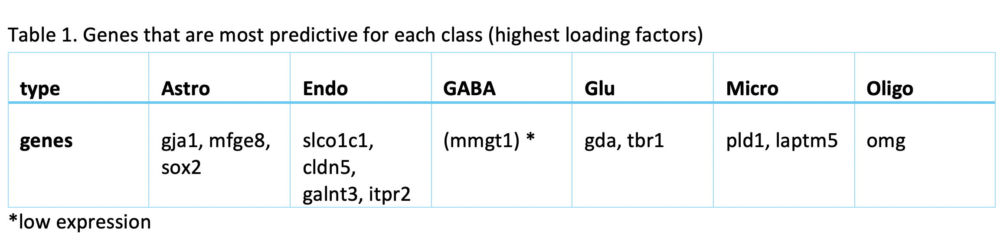
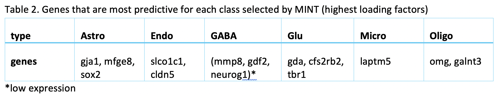

```{r setup, include=FALSE}
knitr::opts_chunk$set(echo = TRUE,warning=FALSE, message=FALSE, eval = TRUE)
```

```{r,echo=FALSE}
#library(devtools)

#if (!requireNamespace("BiocManager", quietly = TRUE))
#    install.packages("BiocManager")
#install_github("HenrikBengtsson/matrixStats")
#install_github("tidyverse/dplyr")
#BiocManager::install("mixOmics")
#install.packages("pdist")
#install.packages("dbscan")
#devtools::install_github("helixcn/spaa")
#install_github("rstudio/rstudioapi")
#install.packages("preprocessCore", repos = "https://bioconductor.org/packages/preprocessCore/", type="source")

library(matrixStats)
library(mixOmics)
library(preprocessCore)
library(dplyr)
```

\bigskip

# Introduction

## Background 

Tasic et al. (2016) used scRNA sequencing to explore the extent of cell types of mouse primal visual cortex. In the study, around 1700 high-quality cells with thousands of genes in primal visual cortex in male adult mice were sequenced on a single cell resolution for cell classification. This study identified 49 cell types, including 23 GABAergic, 19 glutamatergic and 7 non-neural types in the 1700 cells. GABAergic are inhibitory neurons and glutamatergic are excitatory neurons. 

The cell classification result from Tasic et al. (2016) was used by Zhu et al. (2018) to design a study to distinguish the difference between intrinsic and extrinsic effect on gene expression. Intrinsic effect means the regulatory gene network, while extrinsic means the cellular microenvironment. The study was conducted by combining scRNA sequencing data and smFISH data (single-molecule fluorescence in situ hybridization). The former one has high molecular resolution of transcriptomics (thousands of genes) without spatial information, while the latter keeps the spatial information but loses the high resolution (only a few hundred genes). 

Zhu et al. (2018) mapped the sRNA sequencing data to the seqFISH data to enhance the molecular resolution of the cells with spatial information using SVM (support vector machine). The model was trained to identify the major cell type difference by training on scRNA data of 8 groups, GABAergic and Glutamatergic are the major neuron types, and other non-neuronal types, including Astrocytes, Mndothelial cells, microcytes, and three types of Oligocytes. The selected features (genes) were the top 43 differentially expressed (DE) genes in the identified 113 genes. The classification result was FURTHER validated by different evidence like cell type specific staining and previously reported marker genes.

Now, given a dataset of gene expression levels of 1723 cells and 113 genes and the cell types (from Tasic et al. 2016), our taske is to try enhancing the molecular resolusion of another set of cells provided by Zhu et al. (2018), 1597 cells with 113 genes.

**Outline:**

I will adopt a semi-supervised approach to predict the cell type of seqFISH data.

1. Train an sPLS-DA model on scRNA dataset. 
2. Select genes by limiting the number of genes of "keepX" argument of each component during hyperparameter tuning.
3. Predict seqFISH data using the trained sPLS-DA model. 
4. The predictions with high probabilities by the sPLS-DA model will be combined to the original training data for further training. 
5. Train a MINT model on the combined training dataset and predict the rest cells of seqFISH data.
6. Identify the marker genes by examining the loading factors.

This semisupervised method can borrow the information from the seqFISH data and make the model customised. The combination of the data will be used to train a MINT.sPLS-DA model. MINT (Multivariate INTegrative method) (Rohart et al. 2017) is robust for integrating data from different sources regardless of the batch effect. The top discriminative genes identified from the model will be validated using previous literature as evidence. The determination of the minimal number of genes will be done by restricting the values of keepX and the performance will be monitored by balanced error rate (BER).

## Data

First import the data, including the training data (`scRNA`), the training labels (`scRNA_label`), the test data (`seqFISH`) and the predicted test labels by Zhu's paper (`seqFISH_label`).

```{r}
##### import the data #####
scRNA1 = read.delim("tasic_training_b2.txt",header = FALSE, sep ='\t') 
scRNA <- scRNA1[,-1]
rownames(scRNA) <- scRNA1[,1]
scRNA = data.frame(t(scRNA))
rownames(scRNA) <- paste(rep("scRNA",dim(scRNA)[1]),1:dim(scRNA)[1],sep = "_")
  
seqFISH1 = read.delim("seqfish_cortex_b2_testing.txt",header = FALSE, sep ='\t') 
seqFISH <- seqFISH1[,-1]
rownames(seqFISH) <- seqFISH1[,1]
seqFISH = data.frame(t(seqFISH))
rownames(seqFISH) <- paste(rep("seqFISH",dim(seqFISH)[1]),1:dim(seqFISH)[1],sep = "_")

scRNA_label = read.table("tasic_labels.tsv", sep = "\t")[,1]
seqFISH_label = read.table("seqfish_labels.tsv", sep = "\t")[,3]
```

`scRNA` is from Taisc et el. 2016. It contains the gene expression level of 1723 cells with 113 genes. 

```{r}
dim(scRNA)
head(scRNA[,1:6])
```

`seqFISH` is from Zhu et el. 2018. It contains the gene expression level of 1597 cells with the 113 genes shared with `scRNA`. 

```{r}
dim(seqFISH)
head(seqFISH[,1:6])
```

`scRNA_label` has the class of the cells corresponding to `scRNA` data. The phenotyping was done by Tasic et al. and the labels are treated as ground truth in our analysis and are used for training models.  

```{r}
length(scRNA_label)
table(scRNA_label)
```

There are 8 classes in `scRNA_label`. The numbers of cells in each type are not balanced.  

* I will use the following abbreviations for the cell type names in the vignette: **Astro, Endo, GABA, Glu, Micro, Oligo.1, Oligo.2, and Oligo.3**.

`seqFISH_label` has the classes predicted for `seqFISH` data by Zhu et al. The predicitons have not been benchmarked, thus `seqFISH_label` will not be used in our analysis.

```{r}
length(seqFISH_label)
table(seqFISH_label)
```

# Data preprocessing

## Quantile normalisation

First, we check the gene expression distribution of each gene in `scRNA` and `seqFISH`.

```{r, eval = FALSE}
for (i in 1:dim(scRNA)[2]){
  hist(scRNA[,i], main = colnames(scRNA)[i])
}
```

```{r, eval = FALSE}
for (i in 1:dim(seqFISH)[2]){
  hist(seqFISH[,i], main = colnames(seqFISH)[i])
}
```

The histograms show that the features (genes) are of the same scale and the distributions are almost normal. It means that there's no need for further feature normalisation.

Now check the gene expression distribution of the 40 random samples in each dataset. 

```{r,echo=FALSE,fig.height = 3, fig.width=8}
par(mfrow = c(1,1))
random_scRNA = sample(1:1723, 40, replace=FALSE)
boxplot(t(scRNA)[,random_scRNA], names = random_scRNA, 
        main = "gene expression boxplot of 40 random scRNA samples", xlab = "sample ID (scRNA)",cex.main = 2)
random_seqFISH = sample(1:1597, 40, replace=FALSE)
boxplot(t(seqFISH)[,random_seqFISH], names = random_seqFISH, 
        main = "gene expression boxplot of 40 random seqFISH samples", xlab = "sample ID (seqFISH)",cex.main = 2)
par(mfrow = c(1,1))
```

Figure 1. Gene expression distribution of each sample in scRNA data and seqFISH data.

The boxplots show that the the distributions of scRNA data have some sample-wise variation, while seqFISH samples have more consistent distributions.

Some other analyses in the hackalthon did quantile normalisation for paired genes to try to eliminate the differences across datasets. However, I insist that we should do **quantile normalisation** on **samples**. The rationale behind sample quantile normalisation is that although different samples have different differentially expressed (DE) genes, the majority of the genes should express at the same level. That means whichever genes are DE, the mean and quantile of each sample should be of the similar level. 

Therefore, I will unify the quantile normalisation of samples between the datasets to maximumly eliminate the differences between the datasets. The normalisation was done by `normalize.quantiles` function from `preprocessCore` package.

```{r,fig.height = 6}
## QUANTILE normalisation on all the samples
all_data = rbind(scRNA,seqFISH)
library("preprocessCore")
qt_all_data = t(normalize.quantiles(t(all_data),copy=TRUE))
colnames(qt_all_data) <- colnames(scRNA)
# get the quantile normalised scRNA and seqFISH data
qt_scRNA = data.frame(qt_all_data[1:dim(scRNA)[1],])
qt_seqFISH = data.frame(qt_all_data[(1+dim(scRNA)[1]):(dim(scRNA)[1]+dim(seqFISH)[1]),])
```

Then check 40 random samples from each dataset again.

```{r,echo = FALSE,fig.height = 3, fig.width=8}
par(mfrow = c(1,1))
random_qt_scRNA = sample(1:1723, 40, replace=FALSE)
boxplot(t(qt_all_data)[,random_qt_scRNA], names = random_qt_scRNA, 
        main = "gene expression boxplot of 40 random scRNA samples after qt normalisation",
        xlab = "sample ID (scRNA)",cex.main = 2)
random_qt_seqFISH = sample(1:1597, 40, replace=FALSE)
boxplot(t(qt_all_data)[,random_qt_seqFISH], names = random_qt_seqFISH, 
        main = "gene expression boxplot of 40 random seqFISH samples after qt normalisation", 
        xlab = "sample ID (seqFISH)",cex.main = 2)
par(mfrow = c(1,1))
```

Figure 2. Gene expression distribution of 40 random samples in scRNA data and seqFISH data after quantile normalisation.

`qt_scRNA` is quantile normalised scRNA data and `qt_seqFISH` is quantile normalised seqFISH data.

## Oversampling

Let's check the number of samples in each class.

```{r}
table(scRNA_label)
```

The cells of each type are heavily imbalanced in the training data. There is not enough training data for the minor group and the major groups will dominate the classification. Then the model will not have enough power to classify minor groups. To solve the problem, I used two strategies. First, I combined the three subgroups of Oligodendroctyes into one group. This is because in the Tasic paper, some cells were not identified as "core" cells for any Oligo but identified as "intermediate" cells and these three types were identified as close to each other. Also, Oligo.2 has too few samples. The second strategy is to oversample the minor groups. 

First combine the three Oligo subgroups.

```{r}
scRNA_relabel = scRNA_label
scRNA_relabel[c(which(scRNA_relabel == "Oligodendrocyte.1"), which(scRNA_relabel == "Oligodendrocyte.2"), which(scRNA_relabel == "Oligodendrocyte.3"))] = "Oligodendrocyte"
table(scRNA_relabel)
```

```{r}
qt_scRNA_Astro = qt_scRNA[which(scRNA_label == "Astrocyte"),]
qt_scRNA_Endo = qt_scRNA[which(scRNA_label == "Endothelial Cell"),]
qt_scRNA_GABA = qt_scRNA[which(scRNA_label == "GABA-ergic Neuron"),]
qt_scRNA_Glu = qt_scRNA[which(scRNA_label == "Glutamatergic Neuron"),]
qt_scRNA_Micro = qt_scRNA[which(scRNA_label == "Microglia"),]
qt_scRNA_O1 = qt_scRNA[which(scRNA_label == "Oligodendrocyte.1"),]
qt_scRNA_O2 = qt_scRNA[which(scRNA_label == "Oligodendrocyte.2"),]
qt_scRNA_O3 = qt_scRNA[which(scRNA_label == "Oligodendrocyte.3"),]
qt_scRNA_Oligo = rbind(qt_scRNA_O1, qt_scRNA_O2,qt_scRNA_O3)
```

Now, oversample the minor groups.

```{r}
com_qt_scRNA_label = c(rep("Astrocyte", 43*15), rep("Endothelial Cell",29*25),rep("GABA-ergic Neuron",761), rep("Glutamatergic Neuron", 812), rep("Microglia",22*30),rep("Oligodendrocyte", 56*12))
com_qt_scRNA_label = as.factor(com_qt_scRNA_label)
```

We end up with around 700 samples in each class. The total number of cells after oversampling is 4275.

```{r}
length(com_qt_scRNA_label)
table(com_qt_scRNA_label)
```

Correspondingly, the `scRNA` data should also be resized. `com_qt_scRNA` is the oversampled scRNA data. It has 4275 samples.`com_qt_scRNA_label` is the new scRNA label vector.

```{r}
com_qt_scRNA_Astro = qt_scRNA_Astro %>% slice(rep(1:n(), each = 15))
com_qt_scRNA_Endo = qt_scRNA_Endo %>% slice(rep(1:n(), each = 25))
com_qt_scRNA_GABA = qt_scRNA_GABA 
com_qt_scRNA_Glu = qt_scRNA_Glu
com_qt_scRNA_Micro = qt_scRNA_Micro %>% slice(rep(1:n(), each = 30))
com_qt_scRNA_Oligo = qt_scRNA_Oligo %>% slice(rep(1:n(), each = 12))
com_qt_scRNA = rbind(com_qt_scRNA_Astro, com_qt_scRNA_Endo, com_qt_scRNA_GABA, com_qt_scRNA_Glu,
                     com_qt_scRNA_Micro, com_qt_scRNA_Oligo)
```


```{r}
dim(com_qt_scRNA)
```

# Train an sPLS-DA model 

Sparse PLS discriminant analysis (sPLS-DA) is a supervised machine learning algorithm (Lê Cao et al. 2011). Its performance in public microarray and SNP data sets is similar to other algorithms and it's very efficient. The function is available under `mixOmics` package.

Train the sPLS-DA model on preprocessed scRNA data. First tune the number of components.

```{r,fig.height = 3,fig.width = 6}
library(mixOmics)
load('com_qt_tune-SPLSDA.RData')
# build the model
#com_qt_splsda = splsda(com_qt_scRNA, com_qt_scRNA_label, ncomp = 12)
# hyperparameter tuning
#com_qt_perf.splsda <- perf(com_qt_splsda, validation = "Mfold", folds = 5, nrepeat = 8)
plot(com_qt_perf.splsda, overlay = 'measure')
```

The error rate curve for tuning the number of components shows that the **max distance** achieves the lowest error rate and 6 components are enough to reach a low error rate. It's worth noting that after oversampling, the balanced error rate (BER) is similar to overall error rate. I still use BER since the numbers of each class are still different.

Then, tune the number of genes of each compnent. Use **max distance** as the distance method. The number of selected genes in each component is 5, 1, 65, 1, 70 and 10. The BER (balanced error rate, max distance) is 0.103.

```{r,fig.height = 3, fig.width = 5}
#list.keepX <- c(1:10, seq(20, 100, 5))
#com_qt_splsda.tune <- tune.splsda(com_qt_scRNA, com_qt_scRNA_label, ncomp = 6, validation = 'Mfold', folds = 5, dist = 'max.dist',progressBar = T  , test.keepX = list.keepX, nrepeat = 8)

plot(com_qt_splsda.tune, optimal = TRUE, sd = TRUE)
#save(com_qt_splsda, com_qt_perf.splsda, com_qt_splsda.tune, file = 'com_qt_tune-SPLSDA.RData')
com_qt_splsda.tune$choice.keepX
com_qt_splsda.tune$error.rate[27,6]
```

# Restrict the number of genes of each component

We can try using fewer genes for each component. Restrict the number of genes of each component no more than 5. The tuned number of genes of each component is 5, 1, 5, 5, 5 and 5. The BER (max distance) is 0.102, even lower than the model with more genes.

```{r}
load('select_genes.RData')
list.keepX <- c(1:5)
#select_genes.tune <- tune.splsda(com_qt_scRNA, com_qt_scRNA_label, ncomp = 6, validation = 'Mfold', folds = 5, dist = 'max.dist',progressBar = T  , test.keepX = list.keepX, nrepeat = 8)
#save(select_genes.tune, file = 'select_genes.RData')
select_genes.tune$choice.keepX
select_genes.tune$error.rate[5,6]
```

The error rate (training set) of all the classes are low. The error rate of Astro and Micro are 0.0. This may be expalined by the presence of evidently representative marker genes in these two types.

```{r}
select_genes.tune$error.rate.class[,6]
```

```{r}
# this is the final sPLS-DA model
splsda <- mixOmics::splsda
final_sPLSDA.train <- splsda(com_qt_scRNA, com_qt_scRNA_label, ncomp = 6, keepX = c(5,1,5,5,5,5))

# predict seqFISH
final_sPLSDA.predict <- predict(final_sPLSDA.train, qt_seqFISH)

##### sampleplots #####
# comp 1&2
plotIndiv(final_sPLSDA.train, ellipse = TRUE,comp = c(1,2),legend = TRUE, title = "sample plot by splsda" , ind.names = FALSE, type = classic, style = "graphics")
points(final_sPLSDA.predict$variates[,1], final_sPLSDA.predict$variates[,2], cex = 0.5)
legend("topleft",legend = c("scRNA","seqFISH"), pch = 1,pt.cex = c(1,0.5))

# comp 3&4
plotIndiv(final_sPLSDA.train, ellipse = TRUE,comp = c(3,4),legend = TRUE, title = "sample plot by splsda" , ind.names = FALSE, type = classic, style = "graphics")
points(final_sPLSDA.predict$variates[,3], final_sPLSDA.predict$variates[,4], cex = 0.5)
legend("topleft",legend = c("scRNA","seqFISH"), pch = 1,pt.cex = c(1,0.5))

# comp 5&6
plotIndiv(final_sPLSDA.train, ellipse = TRUE,comp = c(5,6),legend = TRUE, title = "sample plot by splsda" , ind.names = FALSE, type = classic, style = "graphics")
points(final_sPLSDA.predict$variates[,5], final_sPLSDA.predict$variates[,6], cex = 0.5)
legend("topleft",legend = c("scRNA","seqFISH"), pch = 1,pt.cex = c(1,0.5))
```

# select the predictions with high probability

The predictions with probability higher than 50% are considered as confident classification. Preserve the cells that have prediction probability over 50%.

```{r}
pred_prob = final_sPLSDA.predict[["predict"]][,,6]
low_prob = which(rowMaxs(pred_prob)<0.5)
seqFISH_label_predicted = final_sPLSDA.predict$class$max.dist[, 6][-low_prob] 
seqFISH_data_predicted = qt_seqFISH[-low_prob,] 
table(seqFISH_label_predicted)
length(low_prob)
```
Around 400 cells are with low prediction prob (< 0.5).

Compare the sPLSDA predictions with Zhu paper
```{r}
predictions = final_sPLSDA.predict$class$max.dist[, 6]
seqFISH_relabel = seqFISH_label
seqFISH_relabel[c(which(seqFISH_relabel == "Oligodendrocyte.1"), which(seqFISH_relabel == "Oligodendrocyte.2"), 
                  which(seqFISH_relabel == "Oligodendrocyte.3"))] = "Oligodendrocyte"
sum(seqFISH_relabel != as.character(predictions))/length(predictions)
```
70.7% of the final predictions of splsda converge with Zhu paper.

The above model used max distance when tuning the hyperparameters. I also tuned the model with other distances. The code for tuning is shown below. The keepX for the other two distance methods are c(5,5,5,5,1,3) and c(5,5,5,5,5,5). The BER are 0.114 and 0.117, respectively.

```{r}
load('other_distance.RData')
#kk.tune <- tune.splsda(com_qt_scRNA, com_qt_scRNA_label, ncomp = 6, validation = 'Mfold', folds = 5, dist = 'centroids.dist',progressBar = T  , test.keepX = list.keepX, nrepeat = 8)
#kkk.tune <- tune.splsda(com_qt_scRNA, com_qt_scRNA_label, ncomp = 6, validation = 'Mfold', folds = 5, dist = 'mahalanobis.dist',progressBar = T  , test.keepX = list.keepX, nrepeat = 8)
centroids.tune$choice.keepX
centroids.tune$error.rate[5,6]
mahalanobis.tune$choice.keepX
mahalanobis.tune$error.rate[5,6]
#save(centroids.tune, mahalanobis.tune, file = 'other_distance.RData')
```

Use these two models to predict the seqFISH data show that for centroids distance 70.32% of the predictions converge with Zhu's paper; for mahalanobis distance 71.25% of the predictions converge with Zhu's paper. 

Now calculate the total number of genes selected in the sPLS-DA model.

```{r}
# calculate the number of selected features
features = c()
for (i in 1:6){
  new_features = rownames(plotLoadings(final_sPLSDA.train, plot = F,contrib = "max", method = "median",comp = i))
  features = c(features,new_features)
}
features = unique(features)
length(features)
```

With only 24 genes the model is able to accurately classify the training data and make the predictions converge with Zhu's paper up to 70%. 

# Identify the marker genes using loading factors 

Plot the loading factors on each component. It shows how much the genes contribute to the class prediction on each component.   

```{r, echo = FALSE,fig.height=4,fig.width = 8}
## loading factors for the trained splsda model
par(mfrow=c(1,2))
plotLoadings(final_sPLSDA.train, comp = 1, method = 'median', contrib = 'max',cex.main = 3) 
plotLoadings(final_sPLSDA.train, comp = 2, method = 'median', contrib = 'max',legend = FALSE, title = "comp2",cex.main = 3)
plotLoadings(final_sPLSDA.train, comp = 3, method = 'median', contrib = 'max',legend = FALSE, title = "comp3",cex.main = 3)
plotLoadings(final_sPLSDA.train, comp = 4, method = 'median', contrib = 'max',legend = FALSE, title = "comp4",cex.main = 3)
plotLoadings(final_sPLSDA.train, comp = 5, method = 'median', contrib = 'max',legend = FALSE, title = "comp5",cex.main = 3)
plotLoadings(final_sPLSDA.train, comp = 6, method = 'median', contrib = 'max',legend = FALSE, title = "comp6",cex.main = 3)
par(mfrow = c(1,1))
```

The following table lists the most indictive genes for each class. 



Regarding the list of genes selected, several were found to be associated with specific cell types: **Gja1** was reported to regulate 
**astrocytic** migration and proliferation (Homkajorn et al. 2010) and was identified as a marker gene of **astrocytes** in the original study of  [2] ; **Cldn5** encodes a protein that forms tight junction strands, as a physical barrier to prevent solutes and water from passing through **endothelial** cell sheets [provided by RefSeq, May 2018];  **Omg** (oligodendrocyte myelin glycoprotein) is present in **Oligodendrocytes**; **Laptm5** was chosen in Bonham et al. 2019 to illustrate the expression profiles for the **microglial** gene module and **Tbr1** was found to be a common genetic determinant for the differentiation of early-born **glutamatergic** neocortical neurons (Hevner et al. 2001). 

In general, the genes found with large loading factors by the sPLS-DA model are backed up with previous studies. The classifier has a biological meaning.

# Predict the rest of the seqFISH data (low probability) with MINT model

The PCA sample plot shows that there is batch effect between training and test datasets. To account for the batch effect, I will use a semi-supervised approach to borrow the information from seqFISH data. MINT algorithm is able to consider the batch effect between datasets. The predictions with high probabilities by sPLS-DA model will be considered as "true" labels here. I will train a MINT model on the combination of the training data and the predictions of seqFISH with high probabilities and predict the seqFISH data that have low probabilities.

```{r pca}
X <- rbind(qt_scRNA, qt_seqFISH)
group <- c(rep("scRNA",1723),rep("seqFISH",1597))
pca <- pca(X, ncomp = 2)
plotIndiv(pca, group = group, legend = T, ellipse = T)
```

The combined data still need oversampling and undersampling due to the imbalance of classes.

```{r, echo=FALSE}
seqFISH_data_tobe_predicted = qt_seqFISH[low_prob,]
#combine the data and labels
X = rbind(qt_scRNA,seqFISH_data_predicted)
dim(X)
study = c(rep(1,1723), rep(2,length(seqFISH_label_predicted)))
X = cbind(X, study)
length(study)
Y = as.factor(c(scRNA_relabel, seqFISH_label_predicted))
length(Y)
table(Y)
```

Here minor groups were oversampled. Major groups were undersampled due to the big data size. Samples in each groups are around 500.

```{r, echo=FALSE}
## still need to balance the classes
X_Astro = X[which(Y == "Astrocyte"),]
X_Endo = X[which(Y == "Endothelial Cell"),]
X_GABA = X[which(Y == "GABA-ergic Neuron"),]
X_Glu = X[which(Y == "Glutamatergic Neuron"),]
X_Micro = X[which(Y == "Microglia"),]
X_Oligo = X[which(Y == "Oligodendrocyte"),]

Y = c(rep("Astrocyte", 127*4), rep("Endothelial Cell", 36*16),rep("GABA-ergic Neuron",500),
                       rep("Glutamatergic Neuron", 500), rep("Microglia",51*9),rep("Oligodendrocyte", 91*5))

X_Astro = X_Astro %>% slice(rep(1:n(), each = 4))
X_Endo = X_Endo %>% slice(rep(1:n(), each = 16))
X_GABA = X_GABA %>% slice_sample(n = 500)
X_Glu = X_Glu %>% slice_sample(n = 500)
X_Micro = X_Micro %>% slice(rep(1:n(), each = 9))
X_Oligo = X_Oligo %>% slice(rep(1:n(), each = 5))

X = rbind(X_Astro, X_Endo, X_GABA, X_Glu, X_Micro, X_Oligo)
study = as.factor(X[,114])
X = X[,-114]
dim(X)
rownames(X) = seq(1, dim(X)[1])
table(Y)
length(Y)
```

```{r, fig.height = 3, fig.width = 5}
# mint algorithm
load('mint.RData')
#mint = mint.splsda(X, Y, study = study, ncomp = 10)
#perf.mint.splsda <- perf(mint, validation = "Mfold", folds = 5,progressBar = TRUE, nrepeat = 8)
plot(perf.mint.splsda, overlay = 'measure')
```

The error rate curve for tuning the number of components shows that 6 component is enough to reach a low error rate. Now plot the hyperparameter tuning. The tuning was done by cross validation.

```{r, fig.height = 3, fig.width = 6}
#list.keepX <- c(1:5)
#mint.splsda.tune <- tune.mint.splsda(X, Y, ncomp = 6,progressBar = TRUE, dist = 'max.dist',                   study = as.factor(study), measure = "BER", test.keepX = list.keepX)
plot(mint.splsda.tune, optimal = TRUE, sd = TRUE)
#save(mint, perf.mint.splsda, mint.splsda.tune, file = 'mint.RData')
```

```{r}
# the chosen keepX after tuning
mint.splsda.tune$choice.keepX
mint.splsda.tune$error.rate[5,6]
```

Here is the final model after tuning.

```{r, fig.height = 3.5, fig.width = 6}
## train mint
mint.train <- mint.splsda(X, Y, ncomp = 6, study = study, 
                              keepX=c(5,1,4,2,5,3))
```

Plot the loading factors on each component. 

```{r, fig.height = 3.5, fig.width = 8}
par(mfrow=c(1,2))
plotLoadings(mint.train, comp = 1, method = 'median', contrib = 'max',title = "contribution on comp1") 
plotLoadings(mint.train, comp = 2, method = 'median', contrib = 'max' ,legend = FALSE, title = "comp2",cex.main = 3)
plotLoadings(mint.train, comp = 3, method = 'median', contrib = 'max' ,legend = FALSE, title = "comp3",cex.main = 3)
plotLoadings(mint.train, comp = 4, method = 'median', contrib = 'max' ,legend = FALSE, title = "comp4",cex.main = 3)
plotLoadings(mint.train, comp = 5, method = 'median', contrib = 'max' ,legend = FALSE, title = "comp5",cex.main = 3)
plotLoadings(mint.train, comp = 6, method = 'median', contrib = 'max' ,legend = FALSE, title = "comp6",cex.main = 3)
par(mfrow = c(1,1))
```

The following table summarises the predictive top genes selected by MINT algorithms. They converged well with the top genes from sPLS-DA. It means that the batch effect does not influence much of the model training. Note that for GABA, there are no significantly high loading-factor gene but some genes with smaller factors. 

The most predictive genes significantly overlap with the genes identified by sPLS-DA model. It means that the gene expression has bigger effect on the prediction rather than the batch effect. It also means that the MINT classifier also has biological meaning.

```{r}
plotIndiv(mint.train, ellipse = TRUE,comp = c(2,3),legend = TRUE, title ="sample plot by mint", cex.main = 3)
#predict the rest of seqFISH
mint.predict <- predict(mint.train, seqFISH_data_tobe_predicted,
                        study.test = rep(2, dim(seqFISH_data_tobe_predicted)[1]))
seqFISH_the_rest = cbind(seqFISH_data_tobe_predicted, mint.predict$class$max.dist[, 6])
colnames(seqFISH_the_rest)[114] = "type"
seqFISH_predicted = cbind(seqFISH_data_predicted,seqFISH_label_predicted)
colnames(seqFISH_predicted)[114] = "type"
final_prediction = rbind(seqFISH_the_rest, seqFISH_predicted)
final_prediction = final_prediction[ order(as.numeric(row.names(final_prediction))), ]
final_labels = final_prediction$type
```

Here is the final prediction.
```{r}
table(final_labels)
```

The following figure shows the mean distribution of each cell type. The predicted cell types show distinct distribution patterns. Note that the mean distribution of GABA cells do not have DE genes. This is aligned with the observation that the predictive genes for GABA have not very high loading factors.

```{r, echo = FALSE, fig.height=3}
#plot the mean distribution of each class 
distribution = rep(0,114)
for (i in levels(as.factor(final_prediction$type))){
  mean = colMeans(final_prediction[final_prediction$type==i,1:113])
  distribution  = rbind(distribution ,c(mean,i))
}
distribution = distribution[-1,]
for (i in 1:6){
  plot(distribution[i,-1],ylim = c(0,70), main = paste("gene distribution of", distribution[i,114]), 
       xlab = "gene_id", ylab = "normalised gene count")
}
```


```{r,echo = FALSE}
seqFISH_relabel = seqFISH_label
seqFISH_relabel[c(which(seqFISH_relabel == "Oligodendrocyte.1"), which(seqFISH_relabel == "Oligodendrocyte.2"), 
                which(seqFISH_relabel == "Oligodendrocyte.3"))] = "Oligodendrocyte"
```

```{r}
sum(seqFISH_relabel != as.character(final_labels))/length(final_labels)
```
65.2% of the predictions converge with Zhu et al. prediction. It is lower than the prediction made by pure sPLS-DA model. Note that Zhu's prediction is not benchmarked. Here is not used for evaluation. For studies with no certain answers, we should compare results from different methods.

# Conclusions

**Conclusions**:   

The provided datasets have been well preprocessed. I further did quantile normalisation across all samples to try to eliminate batch effect before the supervised stage of learning. I also subsampled the data since the classes were imbalanced. The learning algorithm was divided into two stages. First was to learn a classifier on scRNA data using sPLS-DA and predict seqFISH data using the tuned `sPLS-DA` model. The second stage is to select the predictions with high probabilities as the new training data and combine them with scRNA data using `MINT` package. The combined data were used to train a `mint.splsda` model to predict the rest of seqFISH data. Both models were cross validated (M-fold).

The selection of features were done by restricting the values of keepX. sPLS-DA model finally reached 24 features to accurately predict scRNA data. The genes that contribute most to each classes were summarised and many of them could be backed up with literature to be biologically meaningful. The predictive top genes selected by MINT algorithms converged well with the top genes from sPLS-DA. It means that the batch effect does not influence much of the model training. The following table summarises the final prediction of seqFISH data. Finally, I visualised the mean gene distribution of the samples in each class. Each of the class presents a very distinct distribution pattern. Around 70% of the sPLS-DA predictions converged with Zhu's predictions. The semi-supervised approach by MINT had a lower convergence with Zhu's paper (65.2%).

**Limitations and future avenues**:  

The participant who used semi-supervised elastic net mentioned that the cross validation should be done only on the scRNA data. The cross validation at my second stage of training was done on both scRNA data and the seqFISH data that were already predicted. The limitation is that the cross validation was implemented in the package and I was not able to manually change the settings. 

I found it hard to validate the performace of the two-step algorithm (sPLS-DA + MINT) compared with a pure supervised learning only using sPLS-DA. With MINT I ended up only predicting 30% of the cells. Also, the decision on how to do subsampling for the integrated data was tricky.

The spatial analyses were very naive and mainly exploratory. There was no confidence to draw any conlusion for the spatial patterns yet. One of the drawbacks of my analyses was that the methods for categorising spatial domains or categorising cells with spatial information were mainly based on computational efficacy without the consideration of biological contribution. 

Nonetheless, the analyses showed some clues for furture analyses. The next step will focus on improving the design of the metrics for categorising the cells. A finer binning will lean on the understanding of the anatomical and functional structure of primal visual cortex. Also, the metrics for defining the heterogeneity should also use more sensitive method. For example, local Moran's I index is a benchmarked statistic for hetergeneous spatial autocorrelation. This can be applied to the analysis in the future.


\bigskip

# Reference

Bonham, L. W., Sirkis, D. W., & Yokoyama, J. S. (2019). The Transcriptional Landscape of Microglial Genes in Aging and Neurodegenerative Disease. Frontiers in immunology, 10, 1170. https://doi.org/10.3389/fimmu.2019.01170

Lê Cao, K. A., Boitard, S., & Besse, P. (2011). Sparse PLS discriminant analysis: biologically relevant feature selection and graphical displays for multiclass problems. BMC bioinformatics, 12, 253. https://doi.org/10.1186/1471-2105-12-253

Hevner, R. F., Shi, L., Justice, N., Hsueh, Y., Sheng, M., Smiga, S., Bulfone, A., Goffinet, A. M., Campagnoni, A. T., & Rubenstein, J. L. (2001). Tbr1 regulates differentiation of the preplate and layer 6. Neuron, 29(2), 353–366. https://doi.org/10.1016/s0896-6273(01)00211-2

Homkajorn, B., Sims, N. R., & Muyderman, H. (2010). Connexin 43 regulates astrocytic migration and proliferation in response to injury. Neuroscience letters, 486(3), 197–201. https://doi.org/10.1016/j.neulet.2010.09.051

Rohart F., Gautier B., Singh A., and Le Cao K-A. (2017). mixOmics: An R package for 'omics feature selection and multiple data integration. PLoS computational biology 13(11):e1005752
  
Tasic, B., Menon, V., Nguyen, T. N., Kim, T. K., Jarsky, T., Yao, Z., Levi, B., Gray, L. T., Sorensen, S. A., Dolbeare, T., Bertagnolli, D., Goldy, J., Shapovalova, N., Parry, S., Lee, C., Smith, K., Bernard, A., Madisen, L., Sunkin, S. M., Hawrylycz, M., … Zeng, H. (2016). Adult mouse cortical cell taxonomy revealed by single cell transcriptomics. Nature neuroscience, 19(2), 335–346. https://doi.org/10.1038/nn.4216

Zhu, Q., Shah, S., Dries, R., Cai, L., & Yuan, G. C. (2018). Identification of spatially associated subpopulations by combining scRNAseq and sequential fluorescence in situ hybridization data. Nature biotechnology, 10.1038/nbt.4260. Advance online publication.

\pagebreak
```{r}
sessionInfo()
```


